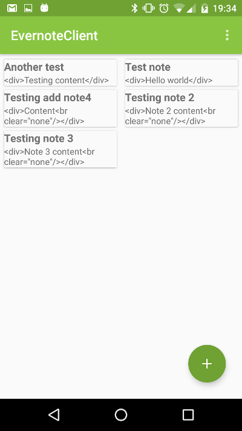
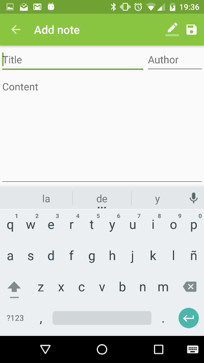
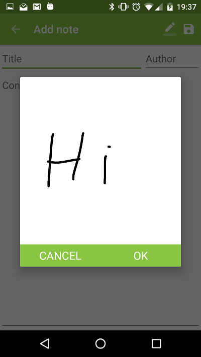

# EvernoteClient
Example of Evernote Android client using a Clean Architecture

**This client uses Evernote Sandbox API. For use this application you have to login using a Evernote Sandbox account [https://sandbox.evernote.com](https://sandbox.evernote.com/).**

### Architecture

The project is developed using MVP (Model View Presenter) and Clean Architecture.

### Data source
On first attempt, I tried to get data using the public Evernote Cloud API, but the oficial documentation is not available anymore ([http://dev.evernote.com/documentation/cloud/](http://dev.evernote.com/documentation/cloud/)).

So, in this project I've used Evernote SDK for Android as data source ([https://github.com/evernote/evernote-sdk-android](https://github.com/evernote/evernote-sdk-android)).

### Features
#### Login
Evernote uses OAuth 1.0 as authentication system ([https://dev.evernote.com/doc/articles/authentication.php](https://dev.evernote.com/doc/articles/authentication.php)). So, I couldn't develop my own view where the user can write his own credentials, instead I had to launch a WebView, wait for the user to write credentials and accept permission and then receive back the obtained token using an android scheme.

On the first attempt, I did this login system by myself, it's pushed in [cloud-api-login](https://github.com/jlmd/EvernoteClient/tree/cloud-api-login) branch. But then, I noticed that I can't use the Evernote Cloude API because the documentation is not available, so I had to use the authentication system which is included in Evernote SDK for Android.

#### List notes
Notes are obtained by [NoteStore.findNotes](https://dev.evernote.com/doc/reference/NoteStore.html#Fn_NoteStore_findNotes) method, then for each note there is a call to [NoteStore.getNote](https://dev.evernote.com/doc/reference/NoteStore.html#Fn_NoteStore_getNote) in order to obtain note contents.

Notes are listed in a RecyclerView using a GridLayoutManager with 2 columns.

#### Sort notes
List notes view has a option menu which provides the user the option of sort the notes using date or title. This sort algorithm is used implementing Comparator interface ([comparator implementations](https://github.com/jlmd/EvernoteClient/tree/develop/app/src/main/java/com/jlmd/android/evernoteclient/domain/comparator)) with Collection.sort method.

#### Note details
When a note is tapped in list notes view, a new view is opened which shows more information about the note, like author and creation date.

#### Add note
There is an option to add new note where user can write title, content and author. Notes are added using [NoteStore.createNote](https://dev.evernote.com/doc/reference/NoteStore.html#Fn_NoteStore_createNote) method.

#### Handwriting new note
Also, new notes can be written by handwriting.

As draw panel I've developed a [custom dialog](https://github.com/jlmd/EvernoteClient/blob/develop/app/src/main/java/com/jlmd/android/evernoteclient/app/ui/custom/drawpanel/DrawPanelDialog.java) with a [custom view](https://github.com/jlmd/EvernoteClient/blob/develop/app/src/main/java/com/jlmd/android/evernoteclient/app/ui/custom/drawpanel/DrawingPanelView.java) where user can draw and when OK button is pressed, generated bitmap is sent back to the activity who call the dialog. Obtained bitmap is sent to an OCR engine, which reads text and then obtained text is written in focused EditText.

I've added Tesseract as OCR engine [https://code.google.com/p/tesseract-ocr/](https://code.google.com/p/tesseract-ocr/) with eng language by default. But **this language doesn't detect most handwriting letter**. I can train a handwriting language using [TrainingTesseract3](https://code.google.com/p/tesseract-ocr/wiki/TrainingTesseract3) but it isn't easy and takes time.

### What should be implemented
- Instrumentation tests
- UI tests
- Trained handwriting tesseract language
- More beautiful UI
- Better error handling
- ENML markup parser
- Logout feature
